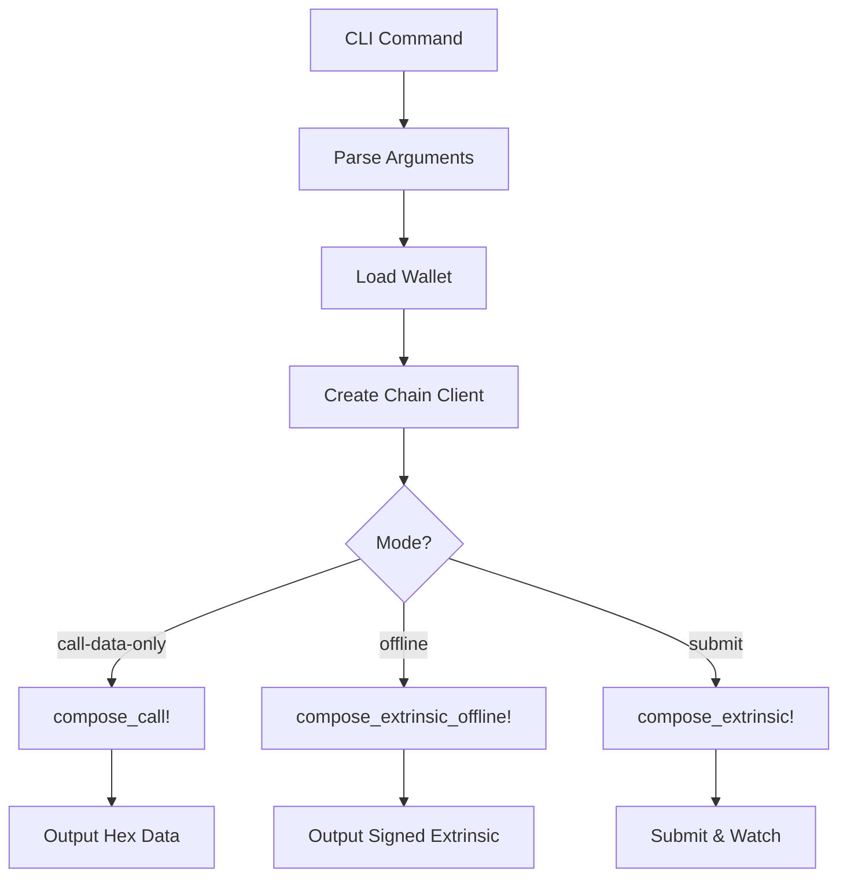

# 🔬 Substrate Compose Macros Analysis

## 🎯 **Executive Summary**

The compose macros from `substrate-api-client` are **PERFECT** for creating a generic CLI that can call ANY pallet function without hardcoded types! Here's what we discovered:

### ✅ **YES - You Can Create Generic Calls!**

The macros use **runtime metadata** to dynamically resolve pallet names and function calls. This means:
- ✅ No specialized functions needed
- ✅ Works with any pallet/call combination
- ✅ Automatically handles type encoding/decoding
- ✅ Perfect for CLI automation

---

## 🧠 **How the Macros Work**

### **1. The Magic Chain: `compose_call!` → `compose_extrinsic!`**

```rust
// Step 1: Create the call
let call = compose_call!(metadata, "Balances", "transfer_allow_death", to, Compact(amount));

// Step 2: Create the extrinsic  
let extrinsic = compose_extrinsic!(api, "Balances", "transfer_allow_death", to, Compact(amount));
```

### **2. The Pattern They Use**

```rust
compose_extrinsic!(self, BALANCES_MODULE, TRANSFER_ALLOW_DEATH, to, Compact(amount))
//                 ^^^^  ^^^^^^^^^^^^^^^  ^^^^^^^^^^^^^^^^^^^^  ^^  ^^^^^^^^^^^^^^
//                 API   Pallet Name      Call Name            Arguments...
```

**Key Insight**: The macro takes:
- `self` (API instance)
- Pallet name (as string)
- Call name (as string)
- Arguments (properly encoded)

---

## 💡 **Why `Compact` Encoding?**

Based on the web search results, `Compact` encoding is used for:

### **Space Efficiency**
- **Purpose**: Reduce transaction size → Lower fees
- **When**: Numeric types like balances, nonces, indices
- **How**: Variable-length encoding (small numbers use fewer bytes)

### **Examples**:
```rust
// Balance: 100 
Compact(100)        // Uses 1 byte
100u128             // Uses 16 bytes

// Balance: 1000000000000000000
Compact(1000000000000000000)  // Uses ~8 bytes  
1000000000000000000u128        // Uses 16 bytes
```

### **When to Use Compact**:
The **pallet metadata** tells you! Each call parameter specifies:
- `Compact<Balance>` → Use `Compact(amount)`
- `Balance` → Use raw `amount`

---

## 🚀 **Offline Extrinsic Creation - The Holy Grail!**

The `compose_extrinsic_offline!` macro is **exactly** what you need to avoid full API clients:

```rust
compose_extrinsic_offline!(
    signer,        // Your keypair
    call,          // From compose_call!
    params         // ExtrinsicParams (nonce, tip, etc.)
)
```

### **Benefits**:
- ✅ No full API client needed
- ✅ Can create signed extrinsics offline
- ✅ Perfect for air-gapped signing
- ✅ Reusable across different chains

---

## 🏗️ **Generic CLI Implementation**

I've created the foundation for your generic CLI:

### **New Command Structure**:
```bash
# Generic call to any pallet/function
quantus call --pallet "Balances" --call "transfer_allow_death" \
  --args '["5GrwvaEF5zXb26Fz9rcQpDWS57CtERHpNehXCPcNoHGKutQY", "1000000000000"]' \
  --from my-wallet

# Offline extrinsic creation
quantus call --pallet "Staking" --call "bond" \
  --args '["5GrwvaEF5zXb26Fz9rcQpDWS57CtERHpNehXCPcNoHGKutQY", "1000000000000", "Staked"]' \
  --from validator-wallet --offline

# Just get call data
quantus call --pallet "Democracy" --call "propose" \
  --args '["some_proposal_hash", "1000000000000"]' \
  --call-data-only
```

### **Implementation Flow**:



---

## 🎯 **Next Steps to Complete Implementation**

### **1. Implement `compose_call!` Integration**
```rust
// In chain/client.rs
pub fn create_generic_call(
    &self,
    pallet: &str,
    call: &str,
    args: &[serde_json::Value]
) -> Result<Call> {
    let metadata = self.api.metadata();
    
    // Parse args based on call signature from metadata
    let parsed_args = parse_args_from_metadata(metadata, pallet, call, args)?;
    
    // Use the macro!
    let call = compose_call!(metadata, pallet, call, ...parsed_args);
    
    Ok(call)
}
```

### **2. Add Argument Parsing Logic**
```rust
fn parse_args_from_metadata(
    metadata: &Metadata,
    pallet: &str,
    call: &str,
    args: &[Value]
) -> Result<Vec<EncodedArg>> {
    // 1. Find pallet in metadata
    // 2. Find call in pallet
    // 3. Get call signature
    // 4. Parse JSON args according to signature
    // 5. Handle Compact encoding automatically
    // 6. Return properly encoded arguments
}
```

### **3. Implement Offline Extrinsic Creation**
```rust
pub fn create_offline_extrinsic(
    &self,
    call: Call,
    keypair: &QuantumKeyPair,
    nonce: u32,
    tip: u128
) -> Result<UncheckedExtrinsic> {
    let signer = keypair.to_resonance_pair()?;
    let params = self.create_extrinsic_params(nonce, tip);
    
    let extrinsic = compose_extrinsic_offline!(signer, call, params);
    
    Ok(extrinsic)
}
```

---

## 🔥 **The Power of This Approach**

### **What This Enables**:
- ✅ **Universal CLI**: Call ANY Substrate pallet function
- ✅ **Future-Proof**: Automatically supports new pallets/calls
- ✅ **Scriptable**: Perfect for automation and testing
- ✅ **Flexible**: Online, offline, and call-data-only modes
- ✅ **Efficient**: Proper Compact encoding for minimal fees

### **Example Use Cases**:
```bash
# Governance proposal
quantus call -p "Democracy" -c "propose" --args '["0x1234...", "1000000"]'

# Staking operations  
quantus call -p "Staking" -c "bond" --args '["validator_addr", "1000000", "Staked"]'

# Identity setting
quantus call -p "Identity" -c "set_identity" --args '[{"display": "My Name"}]'

# Custom pallet calls
quantus call -p "MyCustomPallet" -c "my_function" --args '["arg1", 42, true]'
```

---

## 🎉 **Conclusion**

The compose macros are **PERFECT** for your generic CLI vision! They provide:

1. **Dynamic Resolution**: Use metadata to find any pallet/call
2. **Type Safety**: Automatic encoding/decoding
3. **Flexibility**: Online, offline, and call-data modes
4. **Efficiency**: Proper Compact encoding
5. **Future-Proof**: Works with any Substrate chain

Your CLI will be able to call **ANY** pallet function without hardcoded types - exactly what you wanted! 🚀

The foundation is in place in `src/cli/generic_call.rs`. Just need to implement the actual macro integrations and argument parsing logic. 